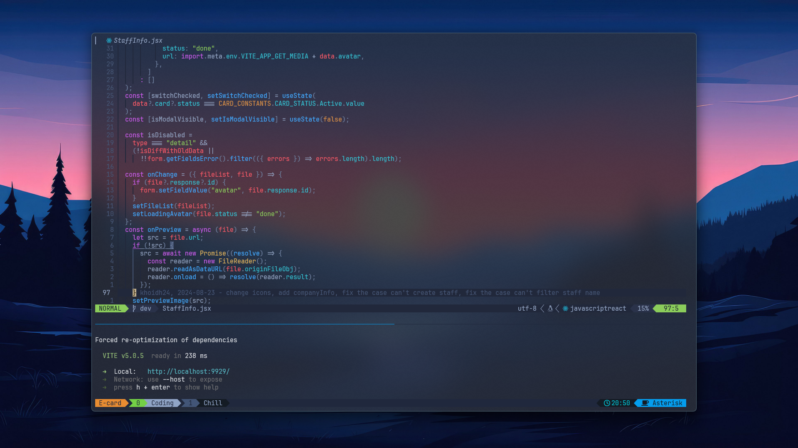

# Puffcatz's Neovim and Tmux dotfiles 🌿



## Setup 💽

### All toys I'm using in this config 🐙

- [Neovim](https://neovim.io/) >= **0.9.0** (needs to be built with **LuaJIT**)
- [Tmux](https://github.com/tmux/tmux/wiki)
- Git
- [LazyVim](https://www.lazyvim.org/) (This config is using custom Lazyvim configurations, not the default setup from the Lazyvim Homepage. For more details, you can read the document [here](https://github.com/folke/lazy.nvim))
- [Nerd Font](https://www.nerdfonts.com/)(v3.0 or greater) **(Font and icons for Terminal. I'm using Jetbrains Mono)**
- [lazygit](https://github.com/jesseduffield/lazygit) **(Optional)**
- **C** compiler for `nvim-treesitter`. See [here](https://github.com/nvim-treesitter/nvim-treesitter#requirements).
- for [telescope.nvim](https://github.com/nvim-telescope/telescope.nvim) **_(optional)_**
  - **live grep**: [ripgrep](https://github.com/BurntSushi/ripgrep) (Find a specific word in workspace)
  - **find files**: [fd](https://github.com/sharkdp/fd)
- Terminal: Optional but these are my suggestion Terminals that support true color and *undercurl*:
  - [kitty](https://github.com/kovidgoyal/kitty) **_(Linux & MacOS)_**
  - [wezterm](https://github.com/wez/wezterm) **_(Linux, MacOS & Windows)_**
  - [alacritty](https://github.com/alacritty/alacritty) **_(Linux, MacOS & Windows)_**
  - [iterm2](https://iterm2.com/) **_(MacOS)_**

### Fish Shell setup (macOS & Linux)

🌿 **A small warning 🚧:** If you wanna code on Terminal completely, This setup will be a MUST HAVE toys in your rice collection 🍚

- [Fish shell](https://fishshell.com/)
- [Fisher](https://github.com/jorgebucaran/fisher) - Plugin manager
- [Tide](https://github.com/IlanCosman/tide) - Shell theme. Use version 6: `fisher install ilancosman/tide@v6`
- [Nerd fonts](https://github.com/ryanoasis/nerd-fonts) - Powerline-patched fonts. I am using Hack.
- [z for fish](https://github.com/jethrokuan/z) - Directory jumping
- [Eza](https://github.com/eza-community/eza) - `ls` replacement
- [ghq](https://github.com/x-motemen/ghq) - Local Git repository organizer
- [fzf](https://github.com/PatrickF1/fzf.fish) - Interactive filtering

## How to use my configurations 👌

Follow these steps:

1. Clone the repo:

```txt 
git clone https://github.com/khoidh24/nvim.git
```

2. Go to repo folder:

```txt 
cd nvim
```

3. Use install Bash script:

```txt 
./install.sh
```

4. Done! Now enjoy your new Neovim setup 😊
